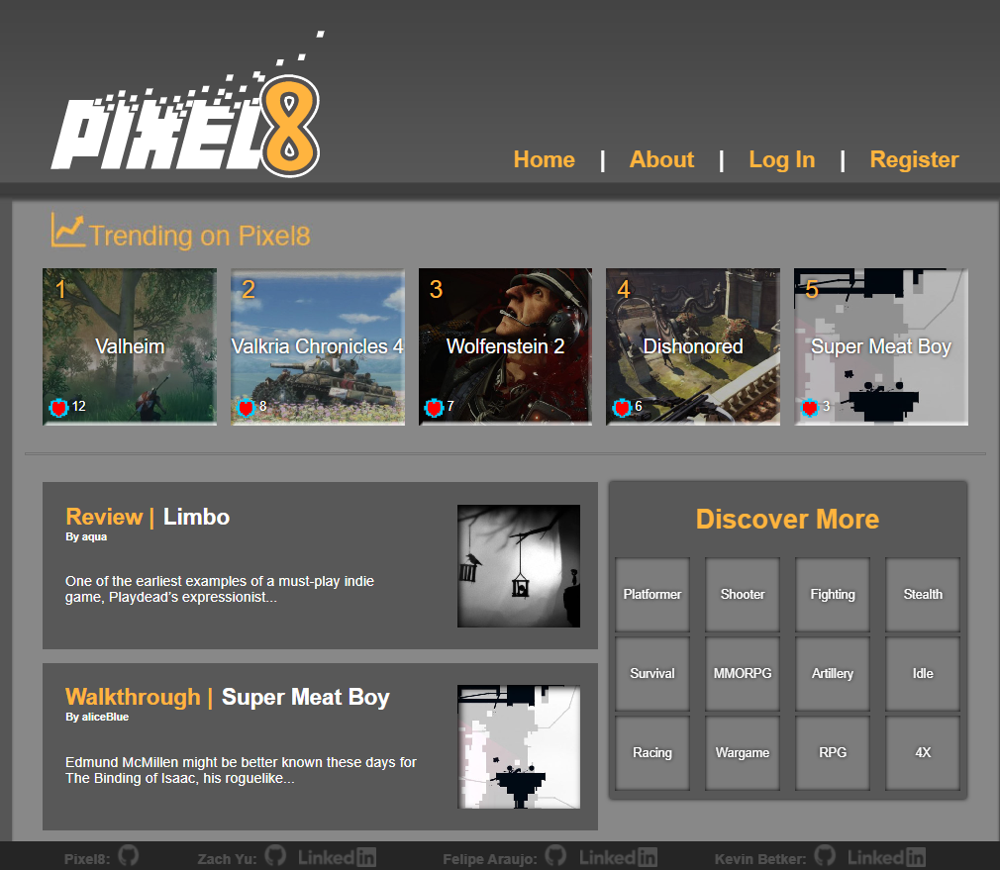

# Pixel8

*By [Felipe Araujo](https://github.com/f-q-a), [Kevin Betker](https://github.com/kbetker), and [Zach Yu](https://github.com/zachmyu).

Where good games find you

[Live site](https://bestpixel8.herokuapp.com/)

**Table of Contents**

* [Pixel8 at a Glance](https://github.com/kbetker/pixel8#Pixel8-at-a-Glance)
* [Key Features](https://github.com/kbetker/pixel8#Key-Features)
* [Technologies Used](https://github.com/kbetker/pixel8#Technologies-Used)
* [Application Architecture](https://github.com/kbetker/pixel8#Application-Architecture)
* [Frontend Overview](https://github.com/kbetker/pixel8#Frontend-Overview)
* [Backend Overview](https://github.com/kbetker/pixel8#Backend-Overview)
* [Conclusion](https://github.com/kbetker/pixel8#Conclusion)

## Pixel8 at a Glance

Pixel8 is a full stack application designed for all game-related articles, where you can read reviews, opinions, walkthroughs, and receive news about the latest and greatest in the gaming world. Read all about upcoming games and honest reviews by users that will help you decide if you would like to buy your next game!

The application is made with a Pug/CSS frontend and all current stories are contributed by the makers of the page. The backend is an Express server with a sequelize database.

**Key Features**

- Read various game related stories and articles contributed by users
- Create new users and have user login with authorization
- Follow favorite users and game types populate feeds with only related stories
- Like and comment on the various articles

## Technologies Used

- Frontend
  - Pug
  - Javascript
  - CSS
- Backend
  - Express
  - Javascript
  - sequelize
  - Heroku deployment

## Application Architecture

The frontend is created using Javascript, Pug, and CSS. The backend is created with Javascript and Express with a sequelize databas. The complete project is deployed to its own Heroku server.

##### Overview of application architecture

##### Pixel8 Sequelize database schema

## Frontend Overview

The frontend is built based off inspiration from the user submitted articles site, Medium.com. All logos, designs, and UI have been designed by one of our team members, Kevin Betker.

Styling was handled using CSS in JavaScript.

Here's an example of the user feeds home page.

## Backend Overview

The Express backend is a collection of RESTful routes serving data to the frontend and an interface with the sequelize database.

Seed data was hand coded by team effort to flesh out all articles, comments, and user-base. The seed data was of particular importance to this application because we needed a lot of articles and even more users in order to have a good sorting basis.

## Conclusion

Pixel8 was a lot of fun to make because our team worked very well together to delegate and spread out all tasks as equally as possible, with everyone on the team contributing to every portion of the project together. Every person on the team was able to contribute to every single task to create the website, including seeder data, CSS, front end mapping and design, as well as back end routing.

We all had different strengths and weaknesses and was able to use these to our advantage to cover everything on the project. We think that the project has turned out great, we've hit all of the features that we wanted to hit and was able to implement a few extra features we had in mind as well. No major roadblocks were hit, and when we hit any minor problems, we were able to troubleshoot it together to help each other solve problems. We've learned a lot and were able to put our knowledge from the course into implementing the website.

Let's go Pixel8 dream team!
